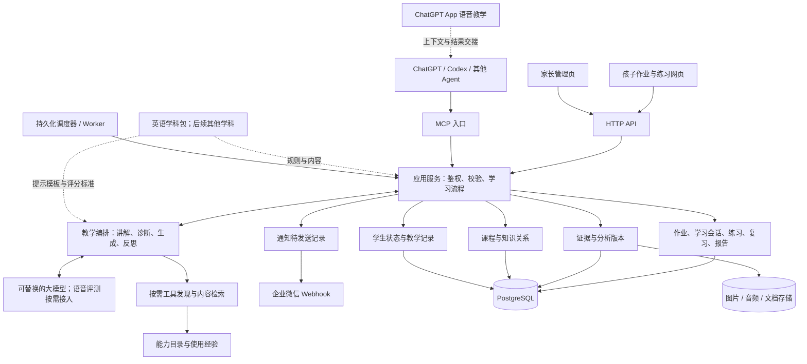

# Learningflow 系统架构

基线来源：建仓前软件框架 v0.1
更新日期：2026-09-12
定位：面向家庭日常学习、由大模型驱动的 Learning Harness
首个学科：小学英语；具体年级、教材版本、课程进度通过学生档案配置。

本架构由正式建仓前的学习跟踪讨论及后续修正收口而来。原始长对话保存在本机 `resources/raw/`，只用于追溯；本文负责当前架构工作基线。其中提到的开源项目、算法和商业产品能力没有自动成为已选方案。

入口修订：孩子主要通过 ChatGPT App 的语音接受教学，服务器网页承担作业与练习作答。现有设备包括 iPhone、iPad、安卓手机、笔记本，套餐为 Plus。实际使用与交接流程见 `../product/真实学习流程.md`；首版不以自建实时语音老师为前提。

## 1. 产品要完成什么

围绕孩子每天真实发生的学习，把“任务 → 作答 → 诊断 → 教学 → 再练 → 延迟复测 → 长期进步”持续运行起来。

教材、考纲和学校进度提供学习目标；作业、试卷、练习和语音提供学习证据；大模型负责理解、讲解、追问和生成；服务器负责保存、执行、调度与追踪。Codex 可以作为开发维护和工具执行中枢，也可以通过 MCP 参与学习辅助。

首期按家庭使用设计，同时支持多个登录账号、多个学生档案和隔离的测试空间。保留跨学科扩展接口，先把小学英语闭环做完整。

### 1.1 三类使用者

| 使用者 | 日常入口 | 需要完成的事 |
|---|---|---|
| 孩子 | ChatGPT App 语音 + 作业网页 | 在 App 听讲与问答，在网页看任务、拍作业、做题和复习 |
| 家长 | 管理页、企业微信通知 | 录入任务、检查识别结果、了解完成情况与进步、调整计划 |
| 维护者 / Codex | 管理页、API、MCP | 导入课程、检查运行记录、测试模型和策略、修复问题 |

“登录账号”和“学生档案”分开：一个家长可以管理多个孩子，多位监护人也可以关联同一学生。

### 1.2 首版范围

首版包括：英语教材与知识点小范围建模、作业任务、图片压缩与 OCR、文字和语音学习、答题与诊断、学习状态、复习调度、家长日报、企业微信通知、基础教学反思、测试与真实数据隔离、API/MCP，以及轻量的工具发现与经验记录。

后续版本再增加其他学科、精细发音评测、更复杂的学习状态算法和更丰富的工具接入。全学段知识图谱、固定全平台连接器集、学校管理和商业化功能不进入首版。

## 2. 总体架构

推荐采用“一个代码库、模块化服务端、独立后台任务进程”的形态。下面是逻辑职责图，框中的模块不代表分别部署微服务。



工具发现是教学编排的可选分支；日常记录、作业提醒、数据库查询可以独立运行。调度器无需等待孩子打开 ChatGPT。

### 2.1 各层职责

| 层次 | 负责什么 | 稳定边界 |
|---|---|---|
| 交互层 | 拍照、录音、呈现题目、采集作答、查看进度 | 保留真实交互过程；页面可以替换 |
| 接入与应用层 | HTTP API、MCP、身份、参数校验、业务命令 | 不同客户端执行同一套业务规则 |
| 教学智能层 | 理解内容、诊断、选择讲法、生成题目、教学反思、调用外部能力 | 输出结构化建议或分析，所有采用结果可追溯 |
| 学习运行层 | 作业与会话状态、答题收集、复习安排、报告、通知触发 | 流程、时序和执行结果由程序维护 |
| 领域数据层 | 原始证据、教材知识结构、学生状态、教学策略及效果 | 事实与派生结论分开；学科包提供领域规则 |
| 基础设施层 | 数据库、媒体存储、后台任务、日志、备份、模型连接 | 对上提供接口，供应商和部署方式可变 |

### 2.2 程序与模型的分工

| 事情 | 程序职责 | 模型职责 |
|---|---|---|
| 一次作答 | 保存原答案、题目版本、提示、重试、时间与来源 | 理解开放式回答 |
| 判分 | 执行确定性评分或保存模型评分版本 | 依据评分标准给开放题评分 |
| 错因 | 关联证据、保存候选及状态 | 提出可验证的错因，设计区分性追问 |
| 掌握情况 | 按版本化策略计算、保留证据范围 | 解释状态，也可作为可替换的估计器提供建议 |
| 下一步练什么 | 提供前置知识、时间预算、候选任务及限制 | 在限制内选择和调整教学活动 |
| 教材内容 | 保存版本、页码、知识点映射和来源 | 辅助提取、解释与关联 |
| 教学反思 | 汇总教学动作及后续表现 | 分析可能有效的方法并提出调整 |
| 日报与通知 | 统计、定时、去重、发送 | 把统计转成家长容易理解的文字 |

掌握度计算器以后可以由规则替换为统计模型或模型辅助估计。无论采用哪种方式，都通过同一状态服务写入，并携带版本和依据。

## 3. 功能模块与页面

| 模块 | 核心功能 | 主要产物 |
|---|---|---|
| 家庭与学生 | 账号关联、学生档案、教材进度、时间安排、测试空间 | Student、Membership、学习配置 |
| 课程与知识 | 教材/考纲导入、章节、知识点、前置关系、学习目标 | Curriculum、Concept、Relation |
| 作业监督 | 录入、开始、暂停、提交、检查、订正、完成、延期 | Task、Submission、状态变更历史 |
| 证据采集 | 图片压缩、OCR、题目切分、文字/语音答案、人工校正 | Media、Extraction、Attempt |
| AI 教学 | 诊断、引导、讲解、生成受约束的题目、语音互动 | Diagnosis、Exercise、TeachingAction |
| 学生状态 | 分知识点与能力维度跟踪、错因演变、证据强弱 | LearnerState、Misconception |
| 复习与评估 | 到期复习、延迟复测、变式验证、阶段比较 | ReviewItem、Assessment |
| 教学反思 | 回看讲法、提示时机、题目设计和保持效果 | Reflection、StrategyRevision |
| 报告与通知 | 完成情况、日报、周报、逾期提示、失败状态 | Report、NotificationDelivery |
| 工具经验 | 查当前能力、按需研究接入方式、记录成功与失败 | CapabilityNote、RetrievalRun |

孩子端保持三个主入口：**今天、开始学习、我的进步**。学习页一次呈现一个活动，提供“再讲一次”“给我提示”“暂停”等明确动作。

家长端采用：**今日总览、作业与待检查、学习档案、教学复盘、资料与设置**。测试空间用明显标记，与真实学生切换分开；模型版本、任务重试等详情放在维护页。

学习档案中的每条重要判断都能点开查看题目、作答、相关图片或音频片段。家长可以对识别和判分提出更正，系统保留修订记录。

## 4. 数据模型：把四种东西分开

### 4.1 原始记录、识别结果、分析判断、当前状态

| 类别 | 示例 | 更新方式 |
|---|---|---|
| 原始记录 | 上传的作业照片、实际录音、孩子直接输入的答案、已展示的提示 | 保留来源；修正另记版本 |
| 提取结果 | OCR 文本、音频转写、题目切分、答案位置 | 可以校正、重新识别，记录对应材料版本 |
| 分析判断 | 判分、知识点映射、错因、发音观察 | 保存分析者、模型/评分标准版本、依据与不确定性 |
| 当前状态 | 知识点掌握情况、活跃错因、待复习项 | 根据当前有效证据重新计算 |

例如，录音是原始材料；“孩子说了 goes”如果只来自转写，就是待核对的识别结果。模型判错不能倒写成孩子实际输入的答案。

### 4.2 核心对象

以下是领域对象，具体建表时可按复杂度合并部分结构，避免为每个名称单独建服务。

| 对象组 | 建议对象 | 必要信息 |
|---|---|---|
| 身份范围 | Workspace、User、Membership、Student | 工作空间、授权关系、学生档案、test/real、时区 |
| 课程要求 | CurriculumVersion、Concept、ConceptRelation、CurriculumMapping | 教材版本、章节/页码、目标、关系类型、审核状态 |
| 日常活动 | Task、Submission、LearningSession | 来源、计划/截止时间、状态、完成依据、实际活动区间 |
| 学习材料 | MediaAsset、ExtractionRevision、SourceMaterial | 媒体地址、校验值、尺寸/时长、来源、提取版本 |
| 题与作答 | ExerciseRevision、Attempt、EvidenceLink | 题目及答案标准快照、原答案、提示、重试、材料定位 |
| 教学判断 | AssessmentRevision、Diagnosis | 评分标准、结论、证据、分析版本、有效/撤回状态 |
| 学生模型 | LearnerState、Misconception、ReviewItem | 学生×知识点×维度×情境、证据充分性、状态版本、复测日期 |
| 教学过程 | TeachingAction、StrategyRevision、Reflection | 教法、目标、提示时机、即时与延迟结果、下一次调整 |
| 报告与运行 | ReportSnapshot、Job、Outbox、Delivery、AuditEvent | 统计截止点、任务租约、去重键、发送结果、操作来源 |
| 工具经验 | CapabilityNote、RetrievalRun | 使用目的、方法、权限需求、最近验证时间、结果来源 |

主关系如下：

```text
工作空间 → 用户授权 / 学生
学生 → 作业 → 提交 → 图片或文档
学生 → 学习会话 → 题目版本 → 多次作答
作答 → 证据关联 → 判分版本 / 错因候选
作答 ← 教学动作（提示、讲解、示范）
学生 + 知识点 + 能力维度 + 情境 → 当前学习状态
有效证据 → 状态计算 → 复习项 → 下一次学习任务
教学动作 + 即时表现 + 延迟复测 → 教学反思 → 策略修订
教材版本 → 知识点映射 ← 知识点及其前置关系
```

一份作业可以有多次提交；一道题可以有多次作答；一次作答可能涉及多个知识点。复习项是安排，作答是实际发生的行为，二者不能混用。

### 4.3 一次作答至少保存什么

```text
身份：workspace_id、student_id、actor_id
定位：task_id?、session_id、exercise_revision_id
行为：attempt_id、attempt_index、raw_answer、input_modality
辅助：hint_ids、assistance_level、是否已经看过答案
时间：occurred_at、received_at、active_duration_ms?
来源：media_id?、页码/图片区域/音频起止位置、source_type
质量：直接记录/从材料提取/自述、提取版本、需复核标记
可靠性：idempotency_key、schema_version、independence_group_id
```

判分引用 Attempt，单独保存。线下作业不知道是否有提示、用了多久时，字段应为“未知”，不能用上传耗时填充。重复上传同一照片不会形成新的独立学习证据；孩子确实重做则保留新的 Attempt，并标明与原题的关系。

## 5. 四条关键运行流程

### 5.1 作业照片进入学习闭环

```text
建立今日作业
→ 拍照上传并生成提交记录
→ 保存可读的归档图、生成预览图
→ OCR / 多模态识别 → 切分题目、提取学生答案
→ 低置信度或冲突结果进入待检查；其余按配置继续
→ 判分并映射知识点
→ 保存错因候选 → 必要时做少量诊断题
→ 讲解与针对性再练 → 更新有效证据和学生状态
→ 安排延迟复测
```

图片处理采用异步任务。建议预览图用于浏览，保留清晰度的归档图用于复查与重识别；压缩标准以小字号、铅笔字、老师批注仍可辨认为验收依据。原始上传件至少保留到归档质量检查完成，后续按家庭配置的保留周期处理。

保留归档图与原上传文件的关系、哈希、压缩参数，以及每个题目区域坐标。旋转、裁切或重新识别生成新版本，不覆盖旧的定位关系。OCR 失败时可以重拍或人工录入。

仅收到照片可以证明“已提交”，是否完成全部作业要由完成规则与检查结果决定。

### 5.2 一次文字或语音教学

```text
读取当前任务、学生状态、教材范围、未解决错因
→ 明确一个学习目标和本次时长
→ 呈现一题 / 一个口语活动
→ 接收作答、保存提示和尝试顺序
→ 判分 / 提出错因候选
→ 追问或改变讲法
→ 用新题或独立表达验证
→ 记录结果、安排复测、结束或暂停会话
```

会话状态由程序维护：准备 → 等待作答 → 评估 → 反馈/练习 → 收尾，也允许暂停、失败与恢复。模型给出的“完成”建议要经过程序检查，实际提交成功才向孩子显示“已保存”。

日常语音教学由 ChatGPT App 承担。开始教学前，向当前对话提供带来源的教学材料；网页练习提交后，把本次具体作答结果交回教学。首版优先在支持工具的文字对话中读取与保存数据，再进入语音。移动端能否在同一对话中使用这些能力需实测；保留可复制教学材料与结果摘要的交接方式。

需要长期保存的朗读/口语作答可单独在作业网页录音。网页采集的录音、目标句和转写版本关联到具体 Attempt；ChatGPT App 内的语音原始音频、提示时机与完整教学记录不假定自动流入服务器。只取得复盘摘要时标记为摘要，不能冒充逐轮原始证据，也不能据此可靠评估音素发音。

程序维护的是学习业务会话，不负责控制 ChatGPT App 的语音生命周期。教学动作通过可验证的工具调用或显式提交的教学复盘写入，缺失部分保留未知。自建实时语音入口作为未来可选路线。

### 5.3 每日监督与主动通知

任务基本状态：

```text
待开始 → 进行中 → 已提交 → 待订正 / 已完成
            ↕                │
           暂停        订正后再次提交
```

另有取消状态；“逾期”由截止时间和完成情况计算，延期记录修改历史。暂停区间不计为学习时间。纸面线下完成允许家长确认，同时保留“家长确认”和“已检查内容”的区别。

服务器按家庭时区检查到期任务与复习项。提醒策略首版只保留少量可配置项：截止前提醒、逾期提醒、每日汇总、免打扰时段与同一任务冷却时间。

通知先写待发送记录，再由 Worker 调用企业微信 Webhook；发送前重新检查任务是否已完成、取消或延期。测试空间只允许测试收件端，无配置时仅记录到测试收件箱，禁止路由真实接收端；真实空间使用该家庭单独配置的接收渠道。

报告先由程序生成统计快照，再交模型写摘要；模型调用失败时仍可发送规则模板日报。每次小错误留在档案中，通知集中呈现需要家长处理的任务和日终结果。

企业微信 Webhook 在本框架中按用户指定渠道设计，接入时用实际群和账号验证可用范围、消息格式与当前限制；不把普通微信账号等同于已配置接收渠道。

### 5.4 教学反思形成第二条反馈链

学习状态回答“孩子现在怎么样”；教学反思回答“我们采取了什么教学动作，后续发生了什么”。

```text
记录讲解方法 / 提示时机 / 练习设计
→ 汇总当场表现
→ 等待并关联延迟复测
→ 每周产生有证据的反思
→ 形成策略修订
→ 后续活动使用新策略并继续验证
```

每条反思包含：目标知识点、策略版本、使用次数、证据范围、即时表现、延迟独立作答表现、干扰因素、结论强弱、建议调整和下次验证时间。

例如：“最近使用对比例句后，孩子两次当场填空正确；三天后口头造句仍出错。下一次减少直接示范，增加无提示造句。”这类描述能指导下一次教学。单个孩子的小样本只说明观察到的变化，不足以宣称某个教法有因果优势。

首版提供系统每周反思和家长查看/编辑。已配置范围内的讲法、题型、提示调整可以自动采用并记录版本；学生负担、长期计划等更大调整作为家长可采纳的建议。

## 6. 学习状态、错因与复习规则

### 6.1 把不同类型的“会”区分开

一个知识点可以展示：

| 观察维度 | 示例证据 |
|---|---|
| 理解 | 能解释为什么使用 does |
| 独立回忆与应用 | 不看提示完成新题 |
| 迁移 | 换题型、换场景或口头表达仍能使用 |
| 保持 | 间隔一段时间后独立答对 |

首版用可解释的版本化规则给出“未接触、证据不足、练习中、基本掌握、稳定掌握”等状态，同时显示证据量、最近验证时间和下一次复习。阶段判断只依据相应活动能测到的维度。

“待复习”是单独标记：间隔变长意味着需要再次验证，不能直接据此断言已经不会。不同知识点、学科或能力维度可以配置不同评估规则。

具体阈值先用测试样例和真实使用反馈调整，不预设一个具有科学效力的掌握百分比。BKT、FSRS、IRT 等保留为后续候选，不在冷启动时同时引入。

### 6.2 错因是可验证的假设

错因状态建议为：候选 → 验证中 → 有较充分支持 → 缓解 / 被否定；后来再次出现时可重新打开。

“Does Tom goes...”可以指向动词原形规则，也可能来自转写错误或其他前置概念问题。模型提出候选后，用少量能区分原因的题目或追问验证。证据不足时保留不确定性，不能把一题的失败扩散为所有关联知识点都不会。

多知识点题只有总分而没有步骤或可定位错误时，记录题目层面表现，待诊断后再更新具体知识点。

### 6.3 复习控制总量

复习策略输入：有效作答、辅助情况、知识点、能力维度、最后验证时间、学校作业负担和每日时间预算。

策略输出：复习目标、建议日期、题型、优先级、预计耗时。首版可用可配置的间隔规则；未完成任务顺延时重新排序，避免每天机械累加。

出题约束至少包含目标知识点、诊断/复习目的、教材范围、已学词汇、题型、预计难度、数量和评分标准。模型生成内容后，程序检查结构和约束；客观题尽可能做答案校验，发现歧义或不合题型的题目重新生成。独立复测题避免原题和答案直接复现。

## 7. 学科包与跨学科扩展

学科包是版本化的内容与规则集合，可有少量学科特定代码。通用内核通过接口读取，不把英语语法规则写进任务、账号、复习和通知模块。

```text
SubjectPack
├── 学科及适用教材版本
├── 知识点、学习目标与前置关系
├── 题型结构与生成约束
├── 评分标准与可用评分器
├── 错因类别和诊断模板
├── 提示与讲解策略
└── 状态计算所需证据规则
```

英语先实现词汇、基础语法、句型、阅读/听力与口头表达所需的最小集合；数学加入时增加计算、步骤、数量关系及对应评分器，继续复用 Attempt、Evidence、Review 和报告。

知识图谱先采用关系表，支持 `prerequisite`、`part_of`、`related_to`、`applied_in` 等类型。前置关系需要检查方向和环路；模型建议的新节点、映射和关系先带来源与草稿状态，重复概念合并时保留旧 ID 对应。

“条件提取”“解释理由”等跨学科能力可以建立共同节点，但状态保留学科、任务类型和语言环境。状态键中的 `context_key` 描述相应学科、语言与任务情境，由学科包约定聚合粒度；跨学科汇总引用这些分情境状态。跨科共性先作为观察假设，多情境验证后再形成结论；英语阅读与数学审题不能直接共用一个掌握分数。

## 8. API、MCP 与按需工具发现

### 8.1 一套业务服务，多个调用入口

HTTP API 面向页面和其他程序；MCP 面向 ChatGPT、Codex 和其他 Agent。二者调用相同应用服务，共用身份校验、数据范围、状态规则与审计。

建议首批 MCP 工具：

| 工具组 | 示例名称 | 作用 |
|---|---|---|
| 查询上下文 | `get_student_context`、`get_today_tasks` | 返回与当前任务有关的近期状态和必要证据 |
| 查询知识与档案 | `get_concept`、`get_evidence`、`get_progress` | 读取知识、历史表现和分析依据 |
| 执行学习 | `start_session`、`submit_attempt`、`request_practice` | 启动活动、提交真实作答、请求受约束练习 |
| 保存分析 | `record_assessment`、`propose_diagnosis` | 保存带证据和来源的判分/候选错因 |
| 作业与复习 | `create_task`、`submit_homework`、`get_due_reviews` | 维护任务并读取到期复习 |
| 反思与工具经验 | `get_teaching_reflections`、`find_capability_notes`、`record_capability_note` | 复用教学反思和工具经验 |

模型侧不提供任意 SQL 或无依据的 `set_mastery(90%)`。被授权的记录操作可以直接执行；服务端验证调用者是否有权操作所选学生，以及引用的证据和题目是否属于同一数据范围。

所有写入工具携带幂等键并返回已保存对象 ID；长任务先返回 job_id 和处理状态。由外部 Agent 代录的答案标明来源，不能冒充页面直接采集。

OpenAI 的 Responses API 支持使用远程 MCP 和自定义工具，可作为自有教学编排服务的接入路线。本文不依赖特定 ChatGPT 套餐、网页语音功能或订阅凭证可被服务器直接调用；客户端接入能力在集成时分别验证。[官方 MCP 与连接器文档](https://developers.openai.com/api/docs/guides/tools-connectors-mcp)

### 8.2 按需发现外部能力

外部模型与平台检索按用户后来的修正设计：

```text
发现当前教学任务缺少信息
→ 判断适合的来源或其他模型
→ 查当前工具目录与历史经验
→ 有可用能力就调用
→ 缺少能力则在限定时间内研究接入方式
→ 获取内容，检查出处、适龄性、教材适配与可信度
→ 保存引用和本次工具经验
```

豆包、元宝、微信、抖音、小红书等是候选来源，不承诺预建完整连接器。能力记录包含目标、可用方法、权限要求、最近成功日期、失败原因和替代方式；过期经验重新验证。

缺少登录、授权或可用接口时返回明确状态，改用已有教材、公开可访问来源或用户提供材料。工具研究在单独执行范围内完成，受时间与费用预算控制，不阻塞保存作答与作业调度。

资料和工具返回文本作为数据处理，不能修改系统指令或扩大授权。公开资料检索默认只传问题与必要上下文；学生身份、完整音频和作业材料的对外使用由已配置的数据范围控制。

## 9. 多用户与测试隔离

推荐用 Workspace 作为数据隔离范围，Student 表示具体学习者。测试空间与真实空间使用不同 ID；`test/real` 用于标识和路由，不能只依赖界面切换或查询条件的约定。

1. 学习业务对象必须携带工作空间和学生范围，服务端从认证关系验证访问权限。
2. 关联题目、材料、作答和状态时校验范围一致；共享的课程内容与学生私有数据明确区分。
3. 文件地址、缓存、后台任务、统计、反思和通知同样携带隔离范围。
4. 测试任务只允许测试通知渠道或测试收件箱，禁止路由真实接收端；回放历史证据默认不创建真实新任务，也不补发通知。
5. 管理/迁移账户与日常运行账户分开，测试数据导入操作显式选定目标空间。

PostgreSQL 行级安全策略可作为第二道数据隔离措施。运行账户不能使用超级用户或 BYPASSRLS，表所有者通常也能绕过策略，因此部署与隔离验收需要覆盖实际数据库角色。[PostgreSQL 行级安全文档](https://www.postgresql.org/docs/current/ddl-rowsecurity.html)

## 10. 后台运行与可恢复性

服务端必须在页面关闭后继续处理图片、到期复习、日报、教学反思与通知。建议把 Job 和通知 Outbox 持久化到数据库，由独立 Worker 领取任务，使用唯一键、租约、失败重试和结果记录。

| 情况 | 处理原则 |
|---|---|
| 上传或答题重复请求 | 按幂等键返回原结果；不重复累计证据 |
| 模型/OCR 暂时失败 | 保存原始材料，允许重试，页面显示待处理 |
| 作答保存后状态尚未更新 | 显示状态计算中，通过事件与数据版本确认进度 |
| 家长更正了 OCR 或判分 | 新增修订、使旧分析失效，重算状态与未来复习；依赖旧判断的反思、报告与策略标为过期/待复核 |
| 较慢的旧分析晚返回 | 对照输入修订号；保存为旧版本，不覆盖更新的结果 |
| 服务器重启 | 恢复未完成任务，按当前时间补算到期事项并合并过时提醒 |
| Webhook 失败 | 按配置重试并记录；响应未知时标记待核对，避免盲目重复发送 |
| 模型升级或重新评估 | 保留历史状态和报告版本，重算结果与旧结果可比较 |

业务写入与待处理事件在同一事务保存；Worker 的处理按“可能重复执行”设计。外部通知端未提供幂等保证时，不能承诺绝对只发送一次。

日报保存统计截止点与有效判分版本，更正后可生成修订版。已发生的教学动作保留历史；受更正影响的策略暂停自动沿用相关结论，复核或重新生成后恢复使用。学习状态重算与通知发送分开，重算本身不产生新的真实作答，也不自动再次发历史消息。

## 11. 部署与代码组织建议

### 11.1 首版技术形态

| 部分 | 建议 | 选择原因 |
|---|---|---|
| 页面 | React + TypeScript 的响应式 Web | 一套页面覆盖家长桌面与孩子手机/平板 |
| 服务端 | Python + FastAPI，模块化单体 | 便于处理教学分析、媒体任务与结构化接口 |
| 数据库 | PostgreSQL | 集中保存多用户业务数据、版本和持久化任务 |
| 图片/音频/文档 | 独立媒体存储接口；首期可用服务器持久化目录，后续替换对象存储 | 数据库保存元信息，文件单独存储和备份 |
| 后台执行 | 与服务端共享代码的 Worker 进程 | 图片处理、模型调用、调度与通知不依赖请求存活 |
| 接入 | HTTPS API + MCP | 页面、Agent 与外部客户端复用业务服务 |
| 部署 | 一台常驻服务器，容器化管理应用与 Worker | 首期运维范围可控，再按实际负载拆分 |

以上是本轮建议，不是已有项目技术事实。FastAPI 提供 OpenAPI、JSON Schema 和自动接口文档，可用于统一 HTTP 数据结构及客户端接口约定。[FastAPI 官方功能文档](https://fastapi.tiangolo.com/features/)

首期知识关系直接存数据库；检索从教材元信息、章节和知识点开始，资料规模需要时再增加向量检索。调度队列先保持轻量，吞吐量或维护成本达到瓶颈后再换成熟独立队列。

媒体访问走授权接口或有时效的下载地址。长期密钥和 Webhook 凭证仅保存在服务端配置，日志记录运行 ID、版本、耗时和错误，避免输出凭证。数据库与媒体需要配套备份，并在测试环境验证恢复；文件保留和删除规则同步覆盖派生记录。

### 11.2 代码目录

```text
learning-harness/
├── apps/
│   ├── web/                    # 孩子端、家长端、维护页
│   ├── server/                 # HTTP 与 MCP 入口
│   └── worker/                 # 调度与异步任务入口
├── backend/
│   ├── identity/               # 用户、学生、空间、授权
│   ├── curriculum/             # 课程与知识关系
│   ├── tasks/                  # 作业与完成规则
│   ├── sessions/               # 学习会话与活动状态机
│   ├── evidence/               # 材料、作答、提取与修订
│   ├── assessment/             # 判分与错因记录
│   ├── learner/                # 学生状态及可替换估计器
│   ├── review/                 # 复习策略与队列
│   ├── teaching/               # 教学动作、反思、策略版本
│   ├── reports/                # 统计快照与报告
│   ├── agents/                 # 教学编排、模型调用、上下文构建
│   ├── capabilities/           # 工具目录、按需研究、使用经验
│   └── infrastructure/         # 数据、文件、任务、通知、日志
├── subject-packs/
│   └── english/                # 首个学科包
├── contracts/                  # API、MCP、事件的数据结构
├── migrations/                 # 数据库变更
├── tests/                      # 闭环、隔离、恢复与评估样例
└── deploy/                     # 部署与备份配置
```

模块通过应用服务协作。模型连接层只处理调用，不直接更新数据库中的学习状态；通知模块不负责教学决策；学科包不能自行绕过身份隔离。

## 12. 首版实施顺序与验收

正式实现前先完成 M0 真实交接验证；M0 的最小对象、状态机、HTTP/MCP Contract 见 [`M0最小闭环设计.md`](M0最小闭环设计.md)。M0 不属于完整首版功能集，它用于证明核心交互值得继续建设。

之后的首版由 M1–M3 三个里程碑共同组成。这样教学反思、照片处理、多用户，以及最初的语音需求都进入首版交付。

| 里程碑 | 交付范围 | 验收场景 |
|---|---|---|
| M0：真实交接验证 | 3 道结构化网页题、草稿、交卷、ResultPack、ChatGPT 自动或 fallback 交接 | 孩子真实设备作答后，原教学上下文取得每题具体答案并继续教学 |
| M1：日常记录可用 | 多用户/测试空间、任务、材料上传压缩、OCR、校正、最小课程结构 | 两个学生与测试空间分别上传作业；材料可回查、状态互不影响 |
| M2：英语教学闭环 | ChatGPT App 语音衔接、网页题目、提示、判分、诊断、状态、复习、可取得的教学记录、API/MCP | 从一道真实错误完成诊断、讲解、独立再练，结果能交回教学，之后能找到复测任务 |
| M3：持续运行可用 | 定时调度、企业微信、日报周报、基础教学反思、工具经验、恢复 | 关闭浏览器后调度继续；生成有证据的周反思；测试通知不进入真实群 |

### 首版必须通过的代表性检查

1. OCR 把答案识别错后，更正能够撤销错误分析对状态的影响，原材料仍可查看。
2. 同一提交重试不重复计数；两次真实作答均保留且可区分是否有提示。
3. “看答案后正确”不会被算作新的独立掌握证据；缺少延迟复测时明确显示保持证据不足。
4. 一道多知识点题的错误不会自动把所有相关知识点都降级。
5. 语音转写可与音频片段核对，低质量录音不会直接形成确定的发音结论。
6. 学生 A 的 API/MCP 身份无法读取学生 B 的记录和媒体；测试空间的任务、统计、反思与通知完全隔离。
7. 应用或 Worker 重启后已提交答案仍在，待处理任务可以继续，旧任务不会覆盖新的识别/判分修订。
8. 任务在发送提醒前完成或延期，过时提醒被取消；发送失败在运行记录中可见。
9. 周反思能回到具体教学动作及之后的作答，不只输出泛化建议；同一证据重算不会重复发日报。
10. 已有工具可被发现并记录使用经验；工具不可用时给出清晰状态，学习记录与调度仍可运行。

开源复用在实际选型时只核对少量候选：附件提到的 Tutor MCP、OpenTutor、DeepTutor，以及英语专项参考 OpenLingo。检查真实仓库、许可、维护情况、数据可迁移性和上述闭环覆盖，再决定借模块或 fork；本框架不建立在某个候选已经满足要求的假设上。

## 13. 后续调整时保持的约定

- 原始学习证据及其来源持续可用；OCR、评分、诊断和学生状态允许重算。
- 所有入口共用身份范围和业务服务；客户端、模型和外部工具可以替换。
- 学科规则放在学科包；课程标准、教材进度和学生实际掌握分别记录。
- 作业完成、学习掌握、教学效果分别评估，通过证据关联。
- 模型能力增强时替换估计器、编排或教学策略，保留历史版本与验证样例。
- 按真实使用推进后续学科与工具，首版验收围绕每天能持续使用的学习闭环。
